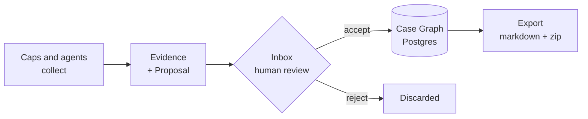

<div align="center">
    <p>
        <a href="https://github.com/kzndotsh/watchdog/actions/workflows/ci.yml">
            </a>
        <a href="https://www.typescriptlang.org">
            </a>
        <a href="https://tanstack.com/start">
            </a>
        <a href="https://www.postgresql.org">
            </a>
        <a href="https://orpc.dev">
            </a>
    </p>
    <h1>Watchdog</h1>
    <p><strong>An OSINT case platform where machines collect and humans decide.</strong></p>
    <p>
        <a href="#quick-start">Quick start</a> •
        <a href="#capabilities">Caps</a> •
        <a href="#architecture">Architecture</a> •
        <a href="#status">Status</a> •
        <a href="docs/README.md">Docs</a> •
        <a href="ROADMAP.md">Roadmap</a>
    </p>
</div>

> [!WARNING]
> **Pre-1.0 and under active development.** Schemas, Cap ids, and API shapes change without notice, and several surfaces in [`ROADMAP.md`](ROADMAP.md) are half-built. It is built for solo and small-team use and has not been hardened for multi-tenant or production deployment.

```
web:    http://127.0.0.1:3000
api:    http://127.0.0.1:3000/api/v1        OpenAPI, x-api-key
spec:   http://127.0.0.1:3000/api/v1/spec.json
cli:    wd cases list
worker: pnpm dev:worker                     required to run jobs
```

Investigation tools tend to fail one of two ways: they automate collection so aggressively your case file fills with unverified junk, or they stay so manual you lose a day to copy-paste. Watchdog splits the difference by making custody a hard boundary instead of a convention.



Postgres holds the truth. The markdown export at the end is a projection you can delete and regenerate.

## The custody rule, in code

This isn't documentation you have to trust. A Cap physically cannot assign confidence to a claim, because the schema rejects it:

```ts
// packages/schemas/src/patch.ts
if (CONFIDENCE_GATED_RESOURCES.has(op.resource) && "confidence" in op.data) {
  ctx.addIssue({
    code: "custom",
    message:
      "op.data.confidence is forbidden — confidence is chosen at Inbox Accept",
    path: ["data", "confidence"],
  });
}
```

Claims land as `unverified`; a human moves them to `possible` or `confirmed` at Accept. An agent can force a direct graph write, but it takes an explicit override flag, still lands at `unverified`, and is recorded in `graph_writes`.

## Quick start

Requires Docker, Node ≥ 22, pnpm 11. [Nix](https://nixos.org/download) is optional and pins the whole toolchain.

```bash
git clone https://github.com/kzndotsh/watchdog.git
cd watchdog

nix develop                 # optional
cp env.example .env         # set BETTER_AUTH_SECRET + WD_MASTER_VAULT_KEY
                            #   openssl rand -base64 32

just up && just minio-init  # Postgres 16 + MinIO
pnpm install
pnpm db:migrate
pnpm dev:web
```

Signup is closed by default. For your first account set `BETTER_AUTH_ALLOW_SIGNUP=1`, restart, register at `/auth/sign-up`, then set it back to `0`.

Everything binds to loopback: web on `:3000`, Postgres on `:5432`, MinIO on `:9100` with its console on `:9101`.

**pnpm only.** Version is pinned in `package.json`; npm and yarn will produce a broken workspace.

## Environment

`@watchdog/env` validates these at boot, so a bad `.env` fails immediately rather than at first query. Copying `env.example` gives you working local defaults for everything except the two secrets.

**Required**

| Variable | Description |
| --- | --- |
| `DATABASE_URL` | Postgres connection string |
| `BETTER_AUTH_SECRET` | Session signing key, 32+ chars |
| `WD_MASTER_VAULT_KEY` | Encrypts Cap credentials at rest; 32-byte base64 or 64-char hex |
| `S3_ENDPOINT` · `S3_ACCESS_KEY` · `S3_SECRET_KEY` · `S3_BUCKET` | Evidence and artifact storage |

**Optional**

| Variable | Description |
| --- | --- |
| `DATABASE_URL_MIGRATE` | Superuser URL for migrations; falls back to `DATABASE_URL` |
| `BETTER_AUTH_URL` | Default `http://127.0.0.1:3000` |
| `BETTER_AUTH_ALLOW_SIGNUP` | Open registration; default off |
| `BETTER_AUTH_TRUSTED_ORIGINS` | Comma-separated extra origins |
| `S3_REGION` | Default `us-east-1` |
| `WD_EXPORT_DIR` | Markdown shadow location; default `<repo>/export` |
| `NODE_ENV` | `development` · `production` · `test` |

The CLI reads its own pair: `WD_API_URL` and `WD_API_KEY`, the latter created in Settings → API Keys. **Cap API keys never go here.** They live in the encrypted vault.

## A case, end to end

```bash
wd cases create --name "Example"
# {"id":"0b8f…","name":"Example","slug":"example"}

wd jobs start -c 0b8f… --cap network.dns.lookup -i '{"host":"example.com"}'
# {"id":"3c21…","status":"queued","capabilityId":"network.dns.lookup"}

wd proposals list -c 0b8f…
# 1 proposal: 4 identifiers, 1 claim (job 3c21…)

wd proposals accept -c 0b8f… 4d90… --confidence possible
wd export zip -c 0b8f…
```

Output is compact JSON so it pipes into `jq`; add `--table` when a human is reading. Lists return a `help` array suggesting the next command, which is how agents navigate without a tutorial. Chain Caps with a playbook instead of running them one at a time:

```bash
wd jobs playbook -c 0b8f… --id host-footprint --host example.com
```

## Capabilities

Each Cap is a folder under `packages/caps/src/` named for its id, such as `network/dns.lookup/`, holding a `run` that collects and a pure `interpret` that maps the report to proposed operations. Keeping `interpret` pure means it tests against recorded fixtures with no network.

| Category | Count | Examples |
| --- | --- | --- |
| `network` | 25 | DNS, WHOIS/RDAP, certificate transparency, TLS audit, Shodan, urlscan |
| `threat` | 17 | VirusTotal, AbuseIPDB, GreyNoise, URLhaus, OTX, Safe Browsing |
| `identity` | 6 | GitHub, Keybase, Gravatar, PGP, email reputation |
| `breach` | 4 | HIBP, Dehashed, Snusbase, Hudson Rock |
| `archive` | 4 | Wayback lookup and fetch, Common Crawl, save-page |
| `evidence` | 4 | Deterministic harvest, AI extraction, file and `.eml` analysis |
| `web` | 3 | URL unshortening, page enrichment |

Every Cap declares its egress (29 make no third-party call at all) and tags itself `Passive` or `Active`, so you know before running one whether it touches the target. Credentials come from an encrypted vault at runtime via `ctx.getCredential`, never from environment variables or job input. Run `pnpm generate:caps` after adding one.

## Architecture

```
apps/
├── web/                  TanStack Start UI + oRPC handlers (RPC + OpenAPI)
└── worker/               pg-boss consumer that executes Cap jobs
packages/
├── env/                  T3 Env boot secrets, depends on nothing
├── schemas/              Zod contracts, PatchOp, vocabulary
├── policy/               Accept gates and custody rules, pure and DB-free
├── db/                   Drizzle schema + repos (the only SQL)
├── core/                 Jobs, graph patching, evidence, export sync
├── caps/                 Cap implementations + playbooks
├── cap-sdk/              Cap SPI: defineCapability, CapContext
├── tools/                Dumb fetch/parse helpers, no Graph types
├── api/                  oRPC router, Zod procedures
├── client/               Typed SDK for /api/v1, generated from OpenAPI
├── cli/                  The `wd` binary, every noun the API exposes
├── ai/                   LLM providers + structuredExtract, never writes Graph
├── log/                  evlog process logging, NDJSON + stdout
└── test-kit/             Dev-only fixtures, Postgres harness, MSW
```

Dependencies flow one direction and the boundaries are enforced, not suggested: `caps` cannot import `db`, `api` cannot reach past `core` to SQL, and only `core` touches repos. Full matrix in [`docs/ARCHITECTURE.md`](docs/ARCHITECTURE.md).

A job's path: `enqueueCapJob` → the `watchdog.cap-jobs` queue → worker runs the Cap → artifacts to S3, Proposal to the Inbox → Accept applies the patch in one transaction → worker re-syncs the case's markdown shadow.

| Layer | Stack |
| --- | --- |
| **Frontend** | TanStack Start · React · Tailwind 4 · shadcn/ui · TanStack Query |
| **API** | oRPC (RPC for the app, OpenAPI for agents) · Zod |
| **Data** | Postgres 16 · Drizzle ORM · MinIO/S3 |
| **Jobs** | pg-boss · dedicated worker process |
| **Auth** | Better Auth (sessions, API keys) |
| **Observability** | evlog structured wide events |
| **Tooling** | pnpm · Nix · just · Vitest · Playwright · oxlint · oxfmt |

## Commands

| Task | Command |
| --- | --- |
| Dev servers | `pnpm dev:web` · `pnpm dev:worker` |
| Database | `pnpm db:migrate` · `pnpm db:generate` · `pnpm db:studio` |
| Containers | `just up` · `just down` · `just minio-init` |
| Reset case data, keep auth and vault | `just wipe` |
| Lint and format | `pnpm check` · `pnpm fix` |
| Types | `pnpm typecheck` |
| Tests | `pnpm test` · `pnpm test:component` · `pnpm test:integration` · `pnpm test:e2e` |
| Codegen | `pnpm generate:caps` · `pnpm generate:client` |

Integration and end-to-end runs need their own databases first: `just test-db`.

## Status

Third design, first one that ships. A vault-plus-Python-pipeline version and a broad platform spec both got frozen before this; [`docs/PRODUCT.md`](docs/PRODUCT.md) records what each one taught and what not to resurrect.

Today: **63 Caps**, **14 packages**, **433 unit and property tests** green. The solo-investigator loop runs end to end: authenticate, create a case, dump evidence, run Caps, accept proposals, export the package.

Not there yet, worth knowing before you invest time:

- **MCP server.** Not built. Agents use the OpenAPI surface today.
- **Playbooks** are linear chains, with no branching and no conditionals.
- **Multi-user collaboration** is thin. Auth and API keys work; team workflows aren't designed yet.
- **End-to-end coverage** is two Playwright flows on top of the unit and integration tiers.

Investigation content (corpus, entity notes, mirrors) lives in a separate private repo and never enters this one.

## What it refuses to do

Some gaps are permanent, and they explain decisions that would otherwise look like oversights:

- No percentage confidence scores. Three tiers a person can defend beat a number implying false precision.
- No corpus or scrape import. This reasons over a case; it does not crawl the internet for you.
- No collection so autonomous that nobody can say where a claim came from.

## Docs

| Read | For |
| --- | --- |
| [`docs/PRODUCT.md`](docs/PRODUCT.md) | Intent, personas, what this refuses to build and why |
| [`docs/ARCHITECTURE.md`](docs/ARCHITECTURE.md) | Packages, import rules, jobs, oRPC, logging |
| [`docs/CAPS.md`](docs/CAPS.md) · [`packages/caps/AGENTS.md`](packages/caps/AGENTS.md) | Cap naming, method vocabulary, ship gates, how to write one |
| [`docs/TYPES.md`](docs/TYPES.md) | Shared Zod schemas and vocabulary |
| [`docs/UX.md`](docs/UX.md) | Information architecture and investigator flows |
| [`apps/web/docs/`](apps/web/docs/README.md) | UI, design system, domains, data fetching |
| [`AGENTS.md`](AGENTS.md) | Conventions for coding agents in this repo |

## License

TBD

Created by [@kzndotsh](https://github.com/kzndotsh)
