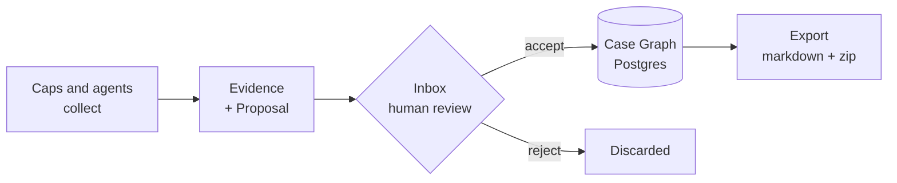

# Watchdog

**An OSINT case platform where machines collect and humans decide.**

[](https://github.com/kzndotsh/watchdog/actions/workflows/ci.yml)

Investigation tools tend to fail in one of two ways: they automate collection so aggressively that your case file fills with unverified junk, or they stay so manual that you lose a day to copy-paste. Watchdog splits the difference by making custody a hard boundary rather than a convention.



63 capabilities can run against a case. None of them can write to the graph. They produce Evidence and a **Proposal**, and a human accepts or rejects it. Postgres holds the truth; the markdown export is a projection you can throw away and regenerate.

---

## The custody rule, in code

This isn't documentation you have to trust. A Cap physically cannot assign confidence to a claim — the schema rejects it:

```ts
// packages/schemas/src/patch.ts
if (CONFIDENCE_GATED_RESOURCES.has(op.resource) && "confidence" in op.data) {
  ctx.addIssue({
    code: "custom",
    message:
      "op.data.confidence is forbidden — confidence is chosen at Inbox Accept",
    path: ["data", "confidence"],
  });
}
```

Confidence is a decision, so it belongs to the person making it. Claims land as `unverified`, and a human moves them to `possible` or `confirmed` at Accept. An agent can force a direct graph write, but it requires an explicit override flag, still lands at `unverified`, and is recorded in `graph_writes`.

---

## Quick start

**Requires:** Docker, Node ≥ 22, pnpm 11. [Nix](https://nixos.org/download) is optional and pins the whole toolchain.

```bash
git clone https://github.com/kzndotsh/watchdog.git
cd watchdog

nix develop                 # optional
cp env.example .env         # set BETTER_AUTH_SECRET + WD_MASTER_VAULT_KEY
                            #   openssl rand -base64 32

just up && just minio-init  # Postgres 16 + MinIO
pnpm install
pnpm db:migrate
pnpm dev:web                # http://127.0.0.1:3000
```

Signup is closed by default. To create your first account, set `BETTER_AUTH_ALLOW_SIGNUP=1`, restart, register at `/auth/sign-up`, then set it back to `0`.

Jobs queue from the web app but need a worker to execute them: `pnpm dev:worker`.

Everything binds to loopback — web on `:3000`, Postgres on `:5432`, MinIO on `:9100` with its console on `:9101`.

---

## A case, end to end

```bash
wd cases create --name "Example"
# {"id":"0b8f…","name":"Example","slug":"example"}

wd jobs start -c 0b8f… --cap network.dns.lookup -i '{"host":"example.com"}'
# {"id":"3c21…","status":"queued","capabilityId":"network.dns.lookup"}

wd proposals list -c 0b8f…
# 1 proposal: 4 identifiers, 1 claim — from job 3c21…

wd proposals accept -c 0b8f… 4d90… --confidence possible
wd export zip -c 0b8f…
```

Output is compact JSON by default so it pipes into `jq`. Add `--table` when a human is reading. Lists return a `help` array suggesting the next command, which is how agents find their way around without a tutorial.

Chain Caps with a playbook instead of running them one at a time:

```bash
wd jobs playbook -c 0b8f… --id host-footprint --host example.com
```

---

## Capabilities

Each Cap is a folder under `packages/caps/src/` named for its id — `network/dns.lookup/` — with a `run` that collects and a **pure** `interpret` that maps the report to proposed operations. Keeping `interpret` pure means it tests against recorded fixtures with no network.

| Category | Count | Examples |
| --- | --- | --- |
| `network` | 25 | DNS, WHOIS/RDAP, certificate transparency, TLS audit, Shodan, urlscan |
| `threat` | 17 | VirusTotal, AbuseIPDB, GreyNoise, URLhaus, OTX, Safe Browsing |
| `identity` | 6 | GitHub, Keybase, Gravatar, PGP, email reputation |
| `breach` | 4 | HIBP, Dehashed, Snusbase, Hudson Rock |
| `archive` | 4 | Wayback lookup and fetch, Common Crawl, save-page |
| `evidence` | 4 | Deterministic harvest, AI extraction, file and `.eml` analysis |
| `web` | 3 | URL unshortening, page enrichment |

Every Cap declares its egress — 29 make no third-party call at all — and tags itself `Passive` or `Active`, so you can tell before running one whether it touches the target. Credentials come from an encrypted vault at runtime via `ctx.getCredential`, never from environment variables or job input.

Run `pnpm generate:caps` to regenerate the catalog after adding one.

---

## Architecture

```
apps/web      TanStack Start UI + oRPC handlers
apps/worker   pg-boss consumer that executes Cap jobs
packages/*    @watchdog/{env,schemas,policy,db,core,api,caps,cap-sdk,tools,ai,log,client,cli,test-kit}
```

Dependencies flow one direction and the boundaries are enforced, not suggested: `caps` cannot import `db`, `api` cannot reach past `core` to SQL, and only `core` touches repositories. The full matrix is in [`docs/ARCHITECTURE.md`](docs/ARCHITECTURE.md).

A job's path: `enqueueCapJob` → the `watchdog.cap-jobs` queue → worker runs the Cap → artifacts to S3 and a Proposal to the Inbox → Accept applies the patch in one transaction → the worker re-syncs the case's markdown shadow.

Built with TanStack Start, Drizzle, Postgres 16, pg-boss, Better Auth, oRPC, Zod, MinIO, Tailwind 4 and shadcn/ui.

---

## For agents

The API was designed for programmatic use first and the UI second. Everything the web app can do is available over OpenAPI at `/api/v1` with an `x-api-key` header.

- Browsable spec at `http://127.0.0.1:3000/api/v1/`
- Machine spec at `GET /api/v1/spec.json`
- Typed SDK: `createWatchdogClient({ baseUrl, apiKey })` from `@watchdog/client`
- Repo conventions for coding agents live in [`AGENTS.md`](AGENTS.md)

---

## Commands

| Task | Command |
| --- | --- |
| Dev servers | `pnpm dev:web` · `pnpm dev:worker` |
| Database | `pnpm db:migrate` · `pnpm db:generate` · `pnpm db:studio` |
| Containers | `just up` · `just down` · `just minio-init` |
| Reset case data, keep auth and vault | `just wipe` |
| Lint and format | `pnpm check` · `pnpm fix` |
| Types | `pnpm typecheck` |
| Tests | `pnpm test` · `pnpm test:component` · `pnpm test:integration` · `pnpm test:e2e` |
| Codegen | `pnpm generate:caps` · `pnpm generate:client` |

Integration and end-to-end runs need their own databases first: `just test-db`.

---

## What's missing

Worth knowing before you invest time:

- **MCP server** — not built. Agents use the OpenAPI surface today.
- **Playbooks** are linear chains. No branching, no conditionals.
- **Corpus and scrape import** is deliberately out of scope. This platform reasons over a case, it does not crawl the internet for you.
- **Multi-user collaboration** is thin. Auth and API keys work; real team workflows are not designed yet.
- **Tests** are a genuine pyramid, but end-to-end coverage is two Playwright flows.

[`ROADMAP.md`](ROADMAP.md) scores every surface honestly, including the ones that are only half-built.

## What it refuses to do

Some of these are permanent, and they explain design decisions that would otherwise look like gaps:

- No machine-set `confirmed`. Ever.
- No percentage confidence scores. Three tiers a person can defend, not a number that implies false precision.
- No second source of truth. The markdown export is derived and disposable.
- No collection so autonomous that nobody can say where a claim came from.

---

## Documentation

| Read | For |
| --- | --- |
| [`docs/PRODUCT.md`](docs/PRODUCT.md) | Intent, personas, what this refuses to build and why |
| [`docs/ARCHITECTURE.md`](docs/ARCHITECTURE.md) | Packages, import rules, jobs, oRPC, logging |
| [`docs/CAPS.md`](docs/CAPS.md) | Cap naming, method vocabulary, ship gates |
| [`docs/TYPES.md`](docs/TYPES.md) | Shared Zod schemas and vocabulary |
| [`docs/UX.md`](docs/UX.md) | Information architecture and investigator flows |
| [`apps/web/docs/`](apps/web/docs/README.md) | UI, design system, domains, data fetching |
| [`ROADMAP.md`](ROADMAP.md) | Maturity by surface |

Investigation content — corpus, entity notes, mirrors — lives in a separate private repository and never enters this one.
